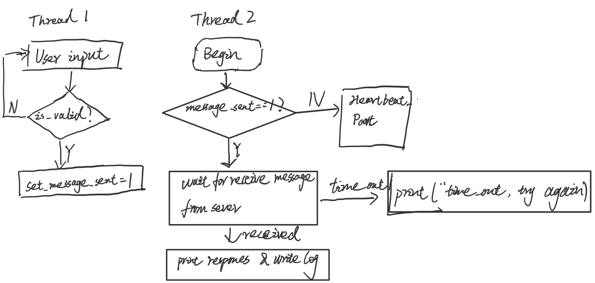
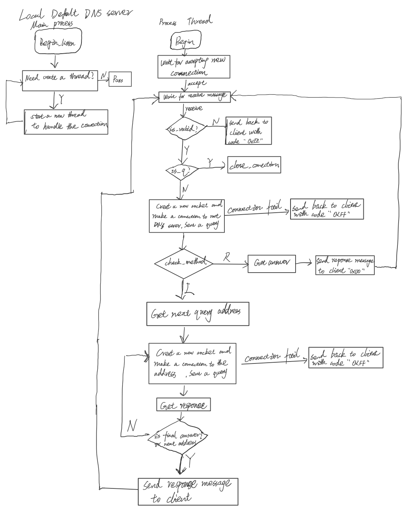
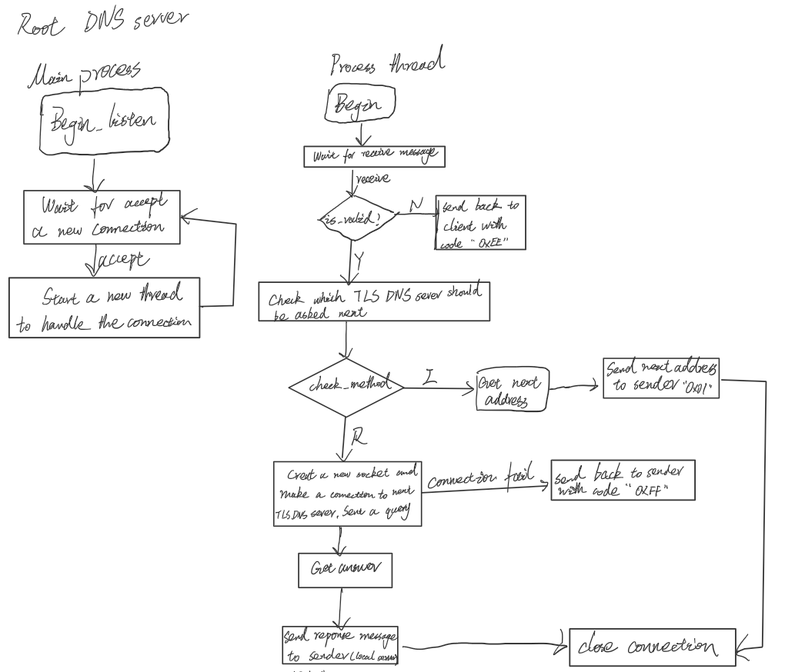
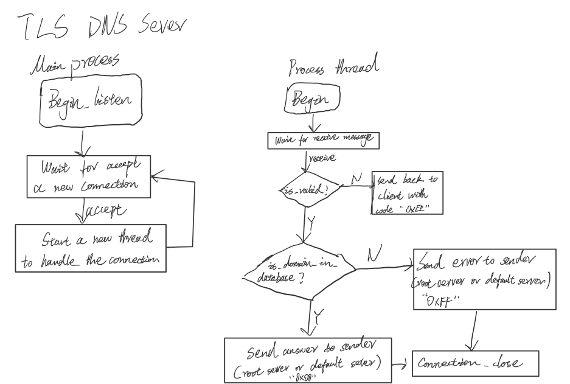
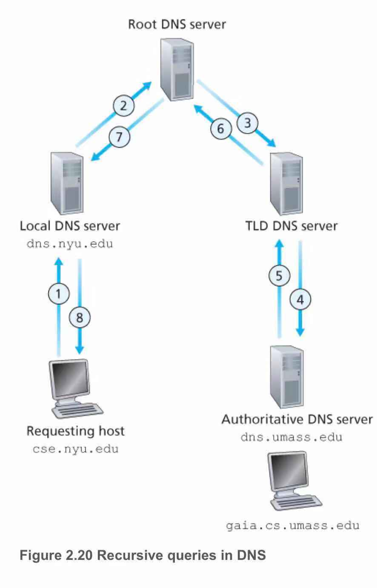

# Project: DNS server-client via TCP protocol
##### Subject: CSCI 4211
##### Author: Wei Dai
##### E-mail: dai00074@umn.edu
##### Date: 11/27/2018
- **(There is a typo in this project that TLD DNS Server is written as TLS DNS Server. Please think the term TLS as TLD. Thanks!)**
- **This project is an implementation of DNS application on the top of TCP. Program language is Python 3.X (be sure to 
use Python 3.X).**
- The directory structure is like this:  
<pre>
submit
├─ client
│    ├─ client_1.py
│    ├─ client_2.py
│    └─ log
│           ├─ PC1.log
│           └─ PC2.log
├─ local_default_server
│    ├─ data
│    │    └─ default.dat
│    ├─ local_server.py
│    └─ log
│           └─ Local_DNS_Server.log
├─ readme.md
├─ root_dns_server
│    ├─ data
│    │    └─ server.dat
│    ├─ log
│    │    └─ Root_DNS_Server.log
│    └─ root_dns_server.py
└─ tls_dns_server
       ├─ __pycache__
       │    └─ tls_dns_server.cpython-36.pyc
       ├─ data
       │    ├─ com.dat
       │    ├─ gov.dat
       │    └─ org.dat
       ├─ log
       │    ├─ COM_DNS_Server.log
       │    ├─ GOV_DNS_Server.log
       │    └─ ORG_DNS_Server.log
       ├─ tls_com.py
       ├─ tls_dns_server.py
       ├─ tls_gov.py
       └─ tls_org.py
 </pre>
 
 # Data Flow
 ### Client
 
  ### Local Default Server
 
  ### Root DNS Server
 
  ### TLS DNS Server
 
 
# User Input
- **To test the project, all five server process should be run first (tls_com.py, tls_gov.py, tls_org.py, 
root_dns_server.py, local_server.py), and then run at least one client process.**
- **In client program, program will ask user to input DNS query in format of domain_name method (I/R) split by any blank character i.e. \t or space, e.g. <google.com R>.**
- **After user input domain and method client will convert user input to standard format i.e. domain in lower case and
 method in capital case. Then, a query request will send to server. (Therefore, the log file could be slightly different 
 from sample sample file.) The reason for standardize is for the convenience for review the log.**
# Some Features
- **In client program, there is a heartbeat detection to check whether the server is crashed.**
### Heartbeat Protocol
- Client will send a heartbeat packet "HEARTBEAT_PACKET_ASK" every 3 seconds to local default DNS server.
- When server receives the heartbeat packet, it will send a acknowledgement "HEARTBEAT_PACKET_ACK". 
- If the acknowledgement packet loss more than 50 times continuously, client will regard server is down or connection 
break. So, client print 'Time out, connection close.' and close the connection and exit.
- If client receive the close broadcast of server, it will print "Server Down. Client will end in 3 second." close connection and exit with exit code -1.
- If server crash down because of other cases such as out of power, client will also print "Server Down. Client will end in 3 second." but with exit code -3.

# Document
### file name: client_1.py
#### Description:
1. This a Python script for query IP address of a domain name, playing a role of DNS client.
2. User input must be domain_name method (I/R) split by any blank character i.e. \t or space. If the input is not split by blank or the length of input is not exactly two, the client will inform user 'it is a invalid input, please try again.'
3. When user input q, the connection between client and server will be closed, and client will close.
4. There is a thread tp handle all received message from server and a heartbeat detection. If the server crash down
       when the client still running, client will receive a broadcast: SERVER_SHUTDOWN: CONNECTION CLOSE.
5. The client will output a log file ({id}.log) whenever it receive or send message to server except the heartbeat
       message because heartbeat message is meaningless.
6. When receive message about response for query request, client will print the message.

### file name: local_server.py
#### description:
0. This a Python script for query IP address of a domain name, playing a role of DNS default local server.
1. When the server start, it will read through a cache file (default.dat initially with no data) and print "server start".
2. The server listen on address (127.0.0.1, 5352). (port: 5352)
3. When new client connects to the server, it will print "accept {ip_address}, {port}" and folk a thread to handle it.
4. The server receives query in format as <id, domain, method(I/R)>, any other formats will be regarded as invalid.
5. When receive domain name with "www." or without "www.", the server will both check whether the two domain names
       are in cache. Because we assume all the domain names with "www." point to the same IP address as its domain name
       without "www.". In fact, www. is a sub-domain, while without www is main domain. E.g. there is no difference
       between [www. bing .com] and [bing .com].
       Reference: https://www.quora.com/What-is-a-webpage-website-without-www-called
6. For resolve query, if the domain is not cached, no matter what the method is, it will establish a new connection
      to root DNS server and make a query with the same method.
   - 5.1. If the method is recursive (R), the result returned by root DNS server is the final answer. Then, send a
           response to client.
   - 5.2. If the method is iterative (I), root DNS server will send next query address. Then, establish a connection
           and make a query.
7. If any of the server that DNS local default server requests break down or loss connection or time out, the local server will
       send <0xFF, {id}, "Host not found"> back to client.
8. When receive heartbeat packet from client, the server will give a acknowledgement.
9. When manager press ctrl + C (KeyboardInterrupt) or system exit, the server will start to shutdown. It will close all 
    the connections and send a broadcast: SERVER_SHUTDOWN: CONNECTION CLOSE to all online users.
10. The server will output a log file ({id}.log) whenever it receive or send message to server/client except the
    heartbeat message because heartbeat message is meaningless.
11. When connection between server and client ends abnormally, i.e. connection break without receive "q",  it will print
 "Loss connection {ip_address}, {port}".
12. Every time when the cache update, server will write the cache to default.dat file to ensure next time the server
    can 'remember' history log.

### file_name: root_dns_server.py
#### description:
1. This a Python script for query IP address of a domain name, playing a role of DNS default local server.
2. When the server start, it will read through a server file (server.dat containing TLS address) and print "server
    start".
2. The server listen on address (127.0.0.1, 5353). (port: 5353)
3. When new client connects to the server, it will print "accept {ip_address}, {port}" and folk a thread to handle it.
4. For resolve query, no matter what the method is, it will check the suffix of the domain name and find out next
    query address. (TLS address)
    - 4.1. If the method is recursive (R),it will establish a new connection to the next query address and make a query
      on behalf of user. The result returned by TLS DNS server is the final answer. Then, send a response to default
      local sever.
    - 4.2. If the method is iterative (I), root DNS server will send next query address back to default local sever.
5. If any of the server that root DNS requests break down or loss connection or time out, the root DNS server will
       send <0xFF, {id}, "Host not found"> back to default local DNS server.
6. We assume root DNS server and TLS DNS server will never break down, so the crash of these server is not handled. In
real life, these servers almost never crash.
7. When connection between root server and local default server ends abnormally, it will print
 "Loss connection {ip_address}, {port}".

### file_name: tls_dns_server.py
#### description:
1. This a Python script for query IP address of a domain name, playing a role of TLS DNS server but it is only a template.
2. When the server start, it will read through a database file (*.dat containing all query about one TLS domain) and
    print "server start".
2. .com TLS server listen on address (127.0.0.1, 5678). (port: 5678)  
    .org TLS server listen on address (127.0.0.1, 5678). (port: 5679)  
    .gov TLS server listen on address (127.0.0.1, 5678). (port: 5680)  
3. When new client connects to the server, it will print "accept {ip_address}, {port}" and folk a thread to handle
    it.
4. For resolve query, no matter what the method is, it will check database and give a response to the sender.
5.  When connection between TSL server and any senders ends abnormally, it will print "Loss connection
    {ip_address}, {port}".
    
# Note:
- **The whole project follows the graph in textbook Figure 2.19 and Figure 2.20. Thus, during recursive queries, as 
Figure 2.20 shown, No. 6 message should not be the same as No. 7 and No. 8 because No. 7 is sent by root server rather 
than TLD DNS server.**
  
- **Therefore, the output file of this project may not be the same as sample log file provided.**